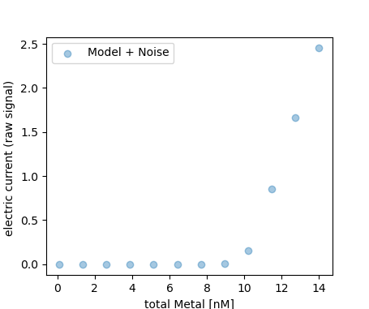
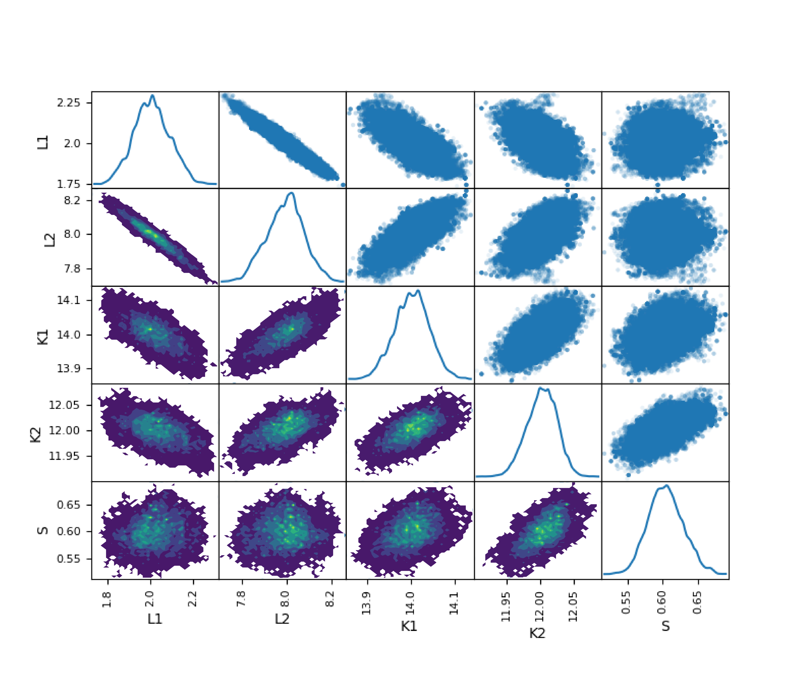

## PyBIComp: a python package for Bayesian Inversion of Complexometric Titration Data 


### usability of the current version
If you clone this project you can simulate a titration curve by running the following lines of code:
```python
import numpy as np 
import matplotlib.pyplot as plt

# importing some utility function from the utils.py
from BayesianComplexometric.utils import _titr_simulate, _optim, _mcmc, _hyb_optim
```
Now we prescribe two metal-binding ligands with concentrations: 2 and 8 nM, and stability constants of: 10<sup>14</sup> and 10<sup>12</sup> M<sup>-1</sup>, respectively. We also add a sensitivity of 0.6 for the voltametry electrode that senses the free metal concetration (I<sub>p</sub> =S  [M]<sub>free</sub>). 
We then simulate an ASV (Anodic Stripping Voltametry) titration curve from these parameters:  
```python
LT = np.array([2, 8])
K = np.array([1e14, 1e12])
MT_ = np.linspace(0.1, 14, 12)
S = 0.6
y_ = _titr_simulate(MT_, LT, K, n_lig = 2)[:,0]
y_obs = S*(y_ + y_*0.03*np.random.normal(0, 1, y_.size))

plt.figure(figsize=[4 , 3])
plt.scatter(MT_, y_obs, alpha = 0.4)
plt.legend(['Model + Noise'])
plt.xlabel('total Metal [nM]')
plt.ylabel('electric current (raw signal) ')
plt.show()
```   
The simulated curve: 


Now, we use our package and the simulated **Model + Noise** to back calculate our 5 above-preset parameters. We first find a single set of optimum parameters: 
```python
lb =  np.array([1, 5, 13, 11 , 0.1], dtype = 'float')
ub =  np.array([4, 10, 15, 14, 1], dtype = 'float')
x = _hyb_optim(y_obs * 0.6,  MT = MT_, lb =lb, ub = ub, S = None, n_lig =2, AL = None, KAL= None)
print(x)
>>> [ 1.97827023  8.08598844 14.05724075 11.98627213  0.6220582 ]
```
As you see single-point optimization can back-calculate the preset parameters with a good accuracy. We then use this pint as an initial point and tun our Markov Chain Monte Carlo (MCMC) algorithm as designed in this package:
```python
samples = _mcmc(x, MT_, y_obs * 0.6,  lb, ub, [0.01 , 0.01, 0.002, 0.002, 0.1], relative_err = 0.06, S = None, AL = None, KAL = None, niter = 100000)
``` 
The resulting probability distributions of parameters: 



